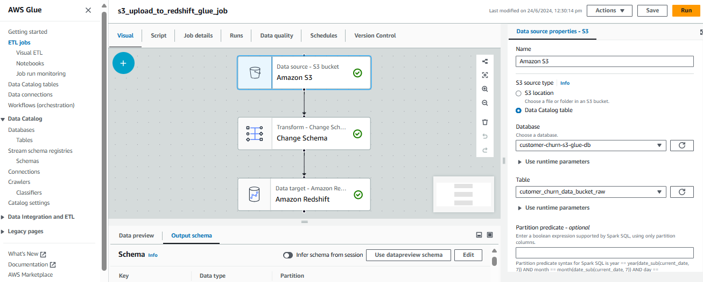
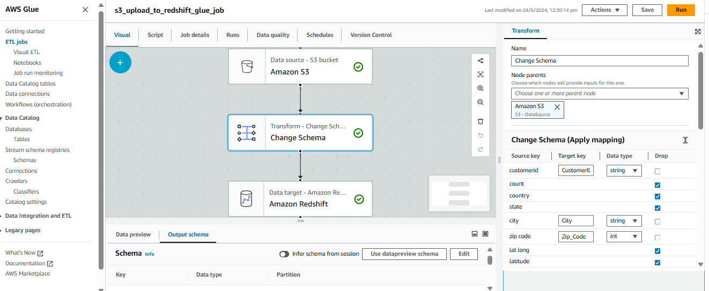
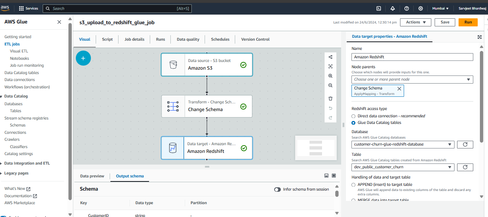

# Customer-churn-data
In this customer churn data engineering project, we will build and automate a python ETL pipeline that would use AWS glue to load data from AWS S3 bucket into an Amazon Redshift data warehouse thereafter connect PowerBi to the Redshift cluster to then visualize the data to obtain insight. AWS glue involves using AWS glue crawler to crawl the S3 bucket to infer schemas and then create a data catalogue on that. We can then also use Amazon Athena to write SQL queries on top of the data catalogue to get insight from the data. The AWS glue also helps in loading the crawled data onto the Redshift cluster. Apache airflow would be used to orchestrate and automate this process.

## Techstack Used
    - Python3
    - S3
    - EC2 (t2.medium)
    - Glue,
    - Athena
    - Redshift
    - Apache Airflow 

## Steps Followed 
    1. After creating an EC2 instance and connecting to EC2 instance run following commands to install dependencies ::
        - sudo apt update
        - sudo apt install python3-pip
        - sudo apt install python3-venv
        - pip3 install apache-airflow apache-airflow-providers-amazon
        - python3 -m venv customer_churn_env
        - source customer_churn_env/bin/activate
        - pip3 install apache-airflow 
        - pip3 install apache-airflow-providers-amazon
    2. Initiate airflow using the following command
        - airflow standalone
    3. Connect to ec2 instance via a code editor (in this case Visual Studio)
    4. Once logged in to ec2 machine via the visual studio, create dag folder inside the airflow directory.
    5. Upload the file to a S3 bucket
    6. Create a glue crawler to infer the file schema (Create an appropriate IAM role for glue)
    7. Table created in database as a part of crawler is stored under DataCatalogue
    8. Use Athena to query data stored on datacatalogue (Create a different S3 bucket to store athena    query results)
    9. Create a redshift cluster
    10. In the redshift cluster, create a table customer_churn(refer to create_table.sql)
    11. Create a redshift-glue connection so that glue can access redshift.
    12. Create a glue crawler to infer schema from the table(customer_churn) that has been created in redshfit cluster (Use JDBC connector option while creating a crawler)
    13. Incase the glue-redshift crawler fails , create a vpc endpoint by
        Redshift --> Selct the cluster --> Go to properties --> Click on vpc to open a new dialogue box --> Create a new endpoint gateway 
        Then run the crawler again. (Cloudwatch logs can be used to get a deeper understanding of errors)
    14. We have created two crawlers - one to read schema from the data in S3 bucket & other to read    schema from the table created in redshift.We need to map the schema of data in S3 bucket as per the schema in table in redshift.
    15. Hence we will be creating an ETL glue job
        Source/Extract :: Table created in database as a part of crawler to infer fileschema from S3
        Transform :: Change the schema and map the columns as per the columns created in Redshift
        Load :: Select the redshift database-table that was created

        Extrct ::
        
        Transform::
        
        Load ::
        

    

# Project Architecture
